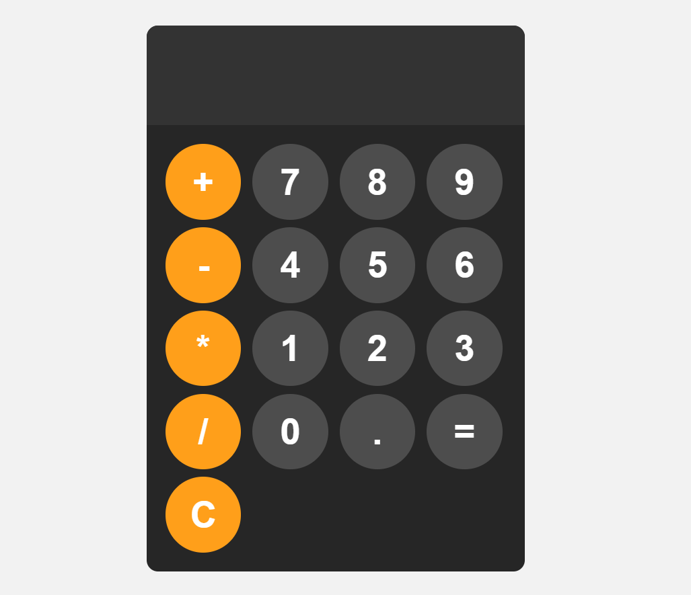
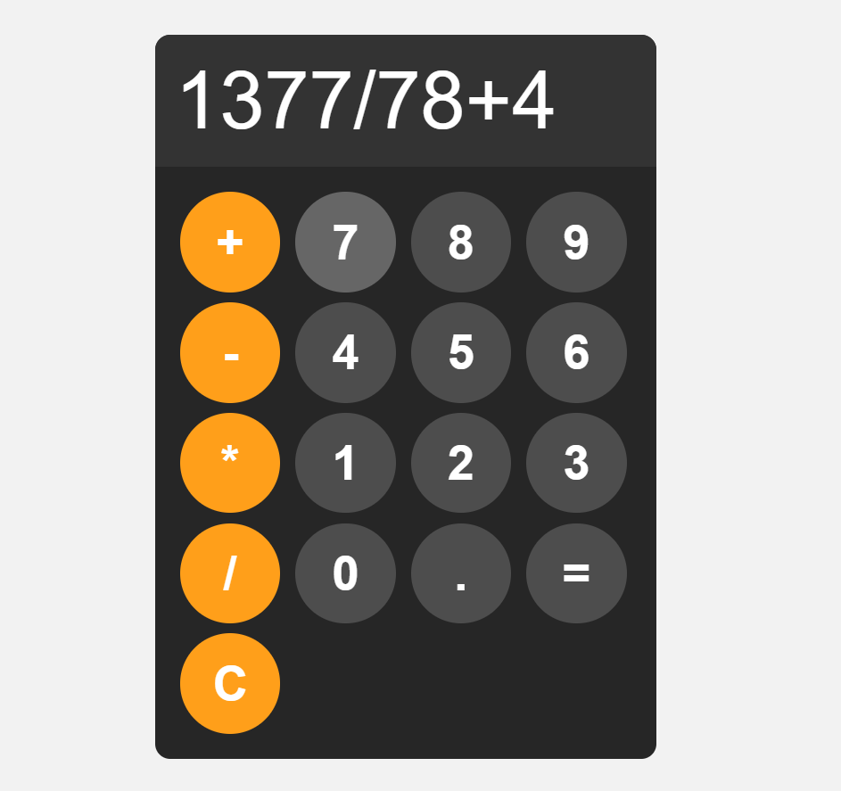

# 🧮 Calculator App

<div align="center">

# Modern Calculator

### Built with HTML, CSS & JavaScript


A sleek and responsive calculator application capable of performing basic arithmetic operations with an intuitive user interface and smooth user interactions.

</div>

---

## ✨ Features

* ➕ Addition
* ➖ Subtraction
* ✖️ Multiplication
* ➗ Division
* 🔢 Decimal Number Support
* 🧹 Clear Display Functionality
* ⚡ Instant Calculation
* 🚨 Error Handling for Invalid Expressions
* 🎨 Interactive Hover & Click Effects
* 📱 Responsive Layout

---

## 📸 Screenshots

<div align="center">



<br><br>



</div>

---

## 🎯 Overview

This project is a browser-based calculator developed using vanilla JavaScript. It allows users to perform basic arithmetic calculations through a clean and modern interface.

The application demonstrates fundamental front-end development concepts including:

* DOM Manipulation
* Event Handling
* CSS Grid Layout
* Error Handling
* Responsive Design

---

## 🛠️ Tech Stack

| Technology       | Purpose          |
| ---------------- | ---------------- |
| HTML5            | Structure        |
| CSS3             | Styling & Layout |
| JavaScript (ES6) | Calculator Logic |

---

## ⚙️ How It Works

### Append Values to Display

Users can enter numbers and operators which are dynamically added to the display.

```javascript
function appendToDisplay(input){
    display.value += input;
}
```

### Clear Display

The calculator can be reset instantly.

```javascript
function clearDisplay(){
    display.value = "";
}
```

### Evaluate Expression

The entered mathematical expression is evaluated and displayed.

```javascript
function calculate(){
    try{
        display.value = eval(display.value);
    }
    catch(err){
        display.value = "ERROR";
    }
}
```

---

## 🎨 UI Highlights

### Modern Dark Theme

* Dark calculator body
* High-contrast display
* Vibrant operator buttons

### Interactive Controls

* Hover effects
* Active click animations
* Smooth user experience

### Organized Layout

The calculator uses CSS Grid for efficient button arrangement.

```css
grid-template-columns: repeat(4, 1fr);
```

---

## 📂 Project Structure

```text
calculator-app/
│
├── screenshots/
│   ├── calculator-home.png
│   └── calculator-calculation.png
│
├── index.html
├── style.css
├── app.js
└── README.md
```

---

## 🚀 Getting Started

### Clone the Repository

```bash
git clone https://github.com/amittdas/calculator-app.git
```

### Navigate to the Project Directory

```bash
cd calculator-app
```

### Run the Application

Simply open:

```text
index.html
```

in your browser.

---

## 📚 Concepts Practiced

* DOM Manipulation
* JavaScript Functions
* Event Handling
* CSS Grid
* Error Handling
* Responsive Web Design
* User Interface Development

---

## 🔮 Future Enhancements

* ⌨️ Keyboard Support
* 🧠 Scientific Calculator Functions
* 📜 Calculation History
* 🌙 Dark / Light Theme Toggle
* ⬅️ Backspace Functionality
* 📱 Enhanced Mobile Responsiveness
* % Percentage Calculations

---

## 👨‍💻 Author

### Amit Das

**Skills**

* HTML
* CSS
* JavaScript
* TypeScript
* MERN Stack
* C++
* Python

GitHub: https://github.com/amittdas

---

<div align="center">

### ⭐ If you like this project, consider giving it a star!

Built with ❤️ using HTML, CSS and JavaScript.

</div>
